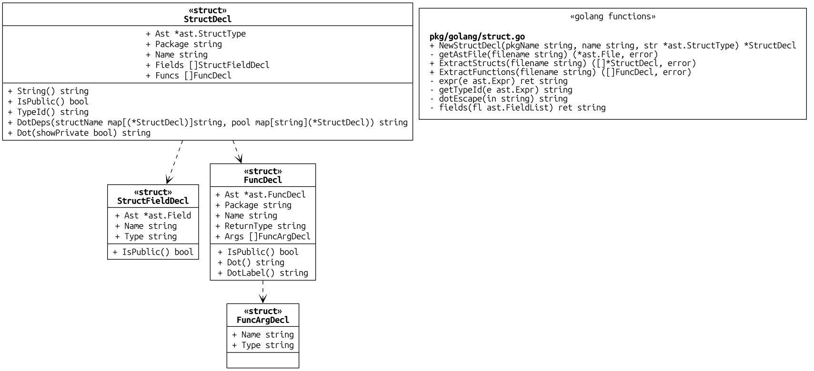

# go2dot

A utility to generate a [Graphviz](https://graphviz.org/) dot graph for a golang package structures and functions.

Example:




## Requirements

You need the following installed and in your path:
- [golang](https://go.dev/doc/install)
- [graphviz/dot](https://graphviz.org/download/)

## Install

Please use [resent version](https://gitlab.com/graphviz/graphviz/-/releases) of dot/graphviz.

```shell
#install dot
brew install graphviz

# Install golang
asdf install golang $(cat .tool-versions | grep "golang" | cut -d" " -f2)

git clone git@github.com:pehrs/go2dot.git
cd ./go2dot
make

export PATH=/path/to/go2dot/bin:$PATH
```

## Usage

### Generate DOT 
```shell
# Generate DOT file for a package (including private functions and structs)
go2dot dot --private ./pkg/golang/ > samples/graph.dot 

# Generate PNG
dot -Tpng samples/graph.dot -o samples/test-pkg-golang.png
```


### Generate image

```shell
# Generate high quality PNG with custom fonts
go2dot graph -Tpng -p ./pkg/golang/ samples/test-pkg-golang.png \
    -x '-Gfontname="Ubuntu Mono" -Nfontname="Ubuntu Mono" -Gsize=4,3 -Gdpi=1000'
```

## Known Issues

- We have not tested go expression to the full yet. The [./samples/sample.go](./samples/sample.go) file is used to represent a "typical" go source for functional testing.

- `dot` does not generate SVG very well.


## Release Notes

### 1.0.0

Initial release
